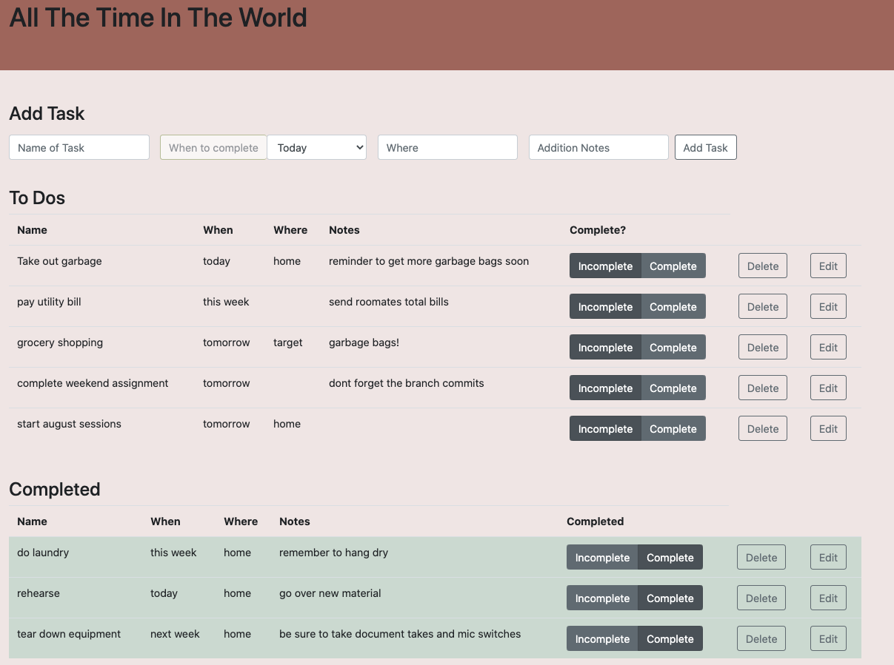

# Project Name

All The Time in the World (sql to-do app)

## Description

## Duration: Three day sprint

This app gives the user the ability to organize their to-do list and keep track of status of tasks and provide users with the great feeling of checking a status complete. Functionality over form in this basic layout, but like my previous app this is equipped with Bootstrap.  To provide the user some quick selections of when this task might be complete, the app provides a simple drop down menu. This is powered by supporting software Popper. 

With this app a user can create a task simply by providing a name. With the help of a drop down menu a user doesn't have to think too hard about when this might be completed. If a user doesn't enter a expected time, its default is set to Today. In the event the user wants to record note/reminders and where the task will be completed the user may those inputs.  Each task is stored on the To Do's table. Once the complete button is selected the task is moved to completed table. The biggest plus of this design, rather than deleting a task after completion, is that the user can reuse the task by setting it incomplete. In this way the app is especially helpful with re-occurring tasks. 

Ideal future functionality could have a time stamp in the entry and when it is completed and also an alert before deleting a task. 

## Built With

- JavaScript
- Bootstrap
- JQuery
- Html
- CSS
- Popper
- Postgres
- Postico

